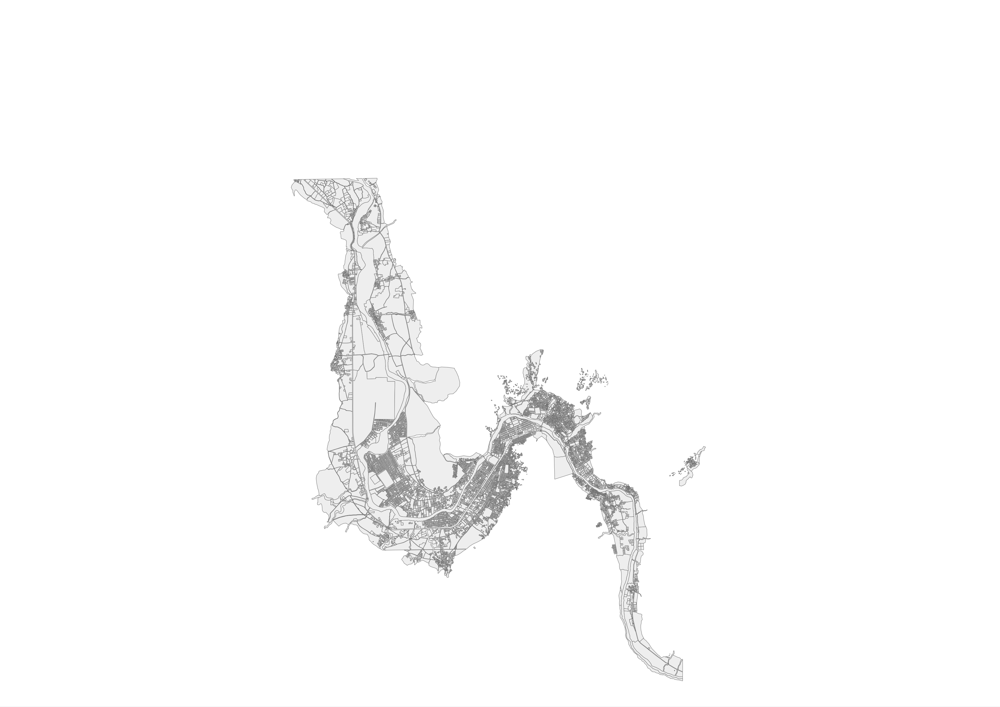
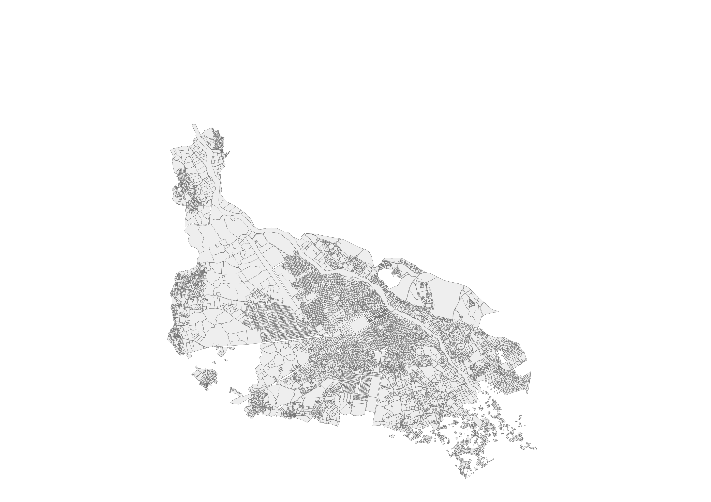
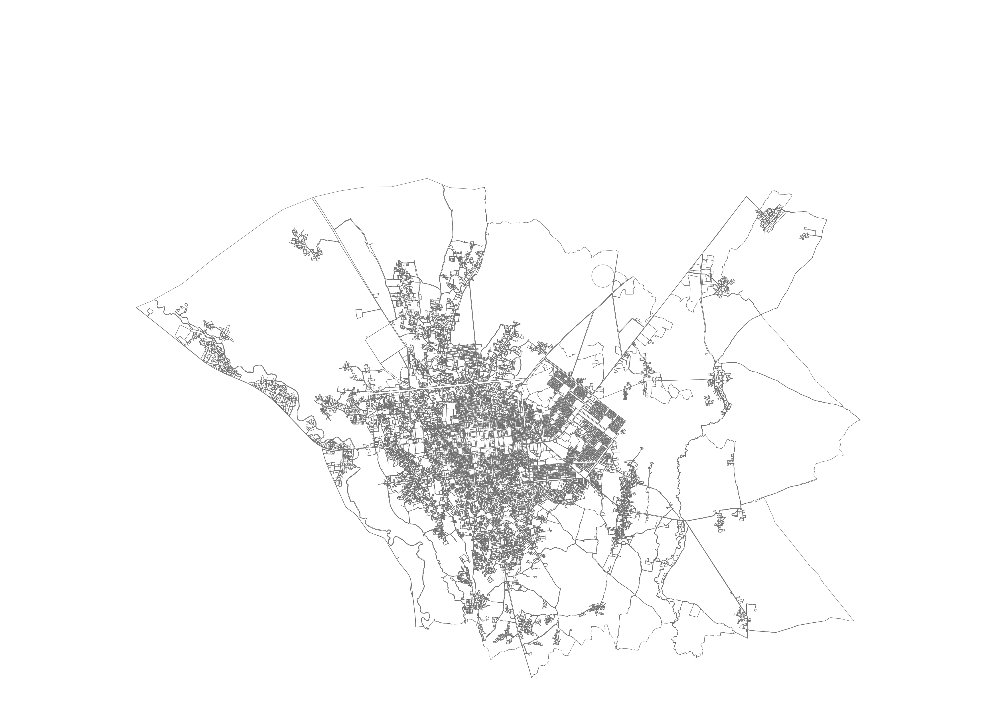

# 219,068 Parcel Boundaries for Municipalities in Northern Afghanistan

RAMP UP North's objective is to strengthen the municipal governments of Northern Afghanistan.
The principal component of this effort involved building a land management system to help government officials  provide better services for their muncipalities.
The data presented here is the output of the the GIS analysts work to demarcate the boundaries of every parcel of property in the municipalities

The data was traced using ArcGIS 10.1 and imagery from xxxx. An effort was made to check data quality pertaining to gaps between adjacent walls but some gaps may still exist in spots.  

## Shapefile Downloads 
Separate shapefiles for each municipality are available here. Each file uses the EPGS:4326 projection.

<table>
	<tr><th>Municipality</th>	<th align='right'>Num Parcels</th>  <th align='right'>Download</th> </tr>
    <tr>
        <td>Faizabad</td> 		<td align='right'>11972</td> <td><a 	href='#'>download</a></td>
    </tr>
    <tr>
        <td>Pul-e Kumri</td> 	<td align='right'>24248</td> <td><a 	href='#'>download</a></td>
    </tr>
    <tr>
        <td>Khulm</td> 			<td align='right'>7925</td> <td><a 	href='#'>download</a></td>
    </tr>
    <tr>
        <td>Mazar-e Sharif</td>	<td align='right'>74000</td> <td><a 	href='#'>download</a></td>
    </tr>
    <tr>
        <td>Andkhoy</td> 		<td align='right'>9657</td> <td><a 	href='#'>download</a></td>
    </tr>
    <tr>
        <td>Maymana</td> 		<td align='right'>13740</td> <td><a 	href='#'>download</a></td>
    </tr>
    <tr>
        <td>Aqcha</td> 			<td align='right'>6277</td> <td><a 	href='#'>download</a></td>
    </tr>
    <tr>
        <td>Sheberghan</td> 	<td align='right'>24823</td> <td><a 	href='#'>download</a></td>
    </tr>
    <tr>
        <td>Kunduz</td> 		<td align='right'>31531</td> <td><a 	href='#'>download</a></td>
    </tr>
    <tr>
        <td>Aybak</td> 			<td align='right'>5210</td> <td><a 	href='#'>download</a></td>
    </tr>
    <tr>
        <td>Sar-e Pul</td> 		<td align='right'>9685</td> <td><a 	href='#'>download</a></td>
    </tr>
</table>

 

## The Uses of Parcel Boundaries
The parcel data is applicable to a variety of situations and is probably most valuable  to Afghan municipal governments, and data practitioners working in Afghanistan. Hopefully, the people of Afghanistan can use the data to simply study and improve the urban areas near where they live.

After the Haiti earthquake, there was a conspicuous lack of spatial data about building infrastructure. This resulted in an [an incredibly fast construction](http://vimeo.com/9182869)of open spatial data in OSM. Presumably, if first responders had access to this data before the earthquake, then disaster response could have been more efficient

Northern Afghanistan has a [history of earthquakes](http://earthquake.usgs.gov/earthquakes/world/historical_country.php#afghanistan), including two in 1998 which in total killed over 6000 people. 

## A Web Map of the Mazar-e Sharif Data
[Interact with the Mazar-e Sharif Data](http://deriggi.github.io/RUNorthArcPy/mazar/mazar.html)

## Sample Visualisations
### Mazar-e Sharif

### Faizabad

### Pulekhumri 

### Khulm

### Maymana

### Shberghan

### Kunduz

