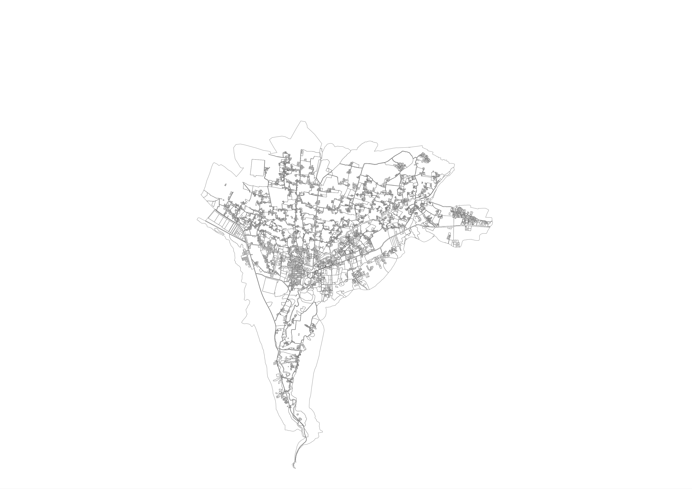
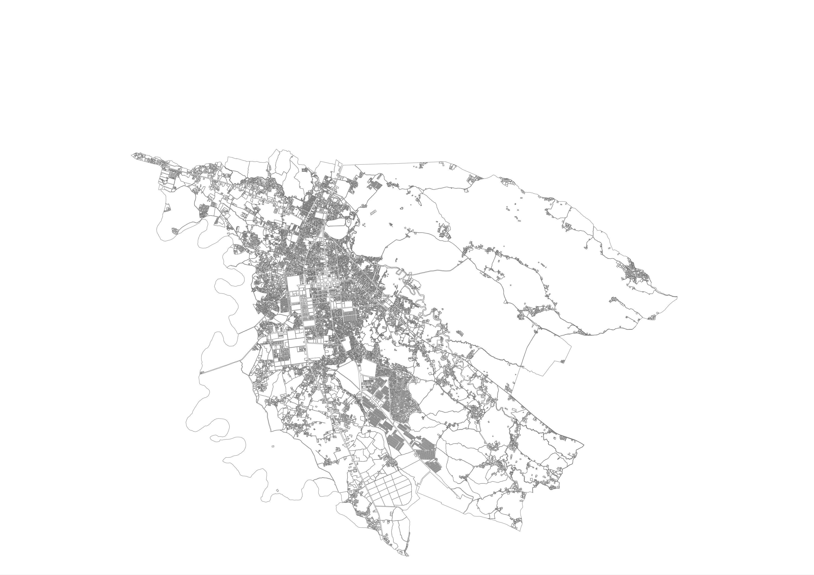

# 219,068 Parcel Boundaries for Municipalities in Northern Afghanistan
RAMP UP North's objective is to strengthen the municipal governments of Northern Afghanistan. 
The principal component of this effort involved building a land management system to help government officials  provide better services for their muncipalities.
The data presented here is the output of the the GIS analysts work to demarcate the boundaries of every parcel of property in the municipalities

The data was traced using ArcGIS 10.1 and imagery from xxxx. An effort was made to check data quality pertaining to gaps between adjacent walls but some gaps may still exist in spots.  

## Data downloads

## Municipality Parcel Count
<table>
	<tr><th>Municipality</th>	<th align='right'>Num Parcels</th></tr>
    <tr>
        <td>Faizabad</td> 		<td align='right'>11972</td> <td><a 	href='#'>download</a></td>
    </tr>
    <tr>
        <td>Pul-e Kumri</td> 	<td align='right'>24248</td> <td><a 	href='#'>download</a></td>
    </tr>
    <tr>
        <td>Khulm</td> 			<td align='right'>7925</td> <td><a 	href='#'>download</a></td>
    </tr>
    <tr>
        <td>Mazar-e Sharif</td>	<td align='right'>74000</td> <td><a 	href='#'>download</a></td>
    </tr>
    <tr>
        <td>Andkhoy</td> 		<td align='right'>9657</td> <td><a 	href='#'>download</a></td>
    </tr>
    <tr>
        <td>Maymana</td> 		<td align='right'>13740</td> <td><a 	href='#'>download</a></td>
    </tr>
    <tr>
        <td>Aqcha</td> 			<td align='right'>6277</td> <td><a 	href='#'>download</a></td>
    </tr>
    <tr>
        <td>Sheberghan</td> 	<td align='right'>24823</td> <td><a 	href='#'>download</a></td>
    </tr>
    <tr>
        <td>Kunduz</td> 		<td align='right'>31531</td> <td><a 	href='#'>download</a></td>
    </tr>
    <tr>
        <td>Aybak</td> 			<td align='right'>5210</td> <td><a 	href='#'>download</a></td>
    </tr>
    <tr>
        <td>Sar-e Pul</td> 		<td align='right'>9685</td> <td><a 	href='#'>download</a></td>
    </tr>
</table>

## A Web Map of the Mazar-e Sharif Data
[Interact with the Mazar-e Sharif Data](http://deriggi.github.io/RUNorthArcPy/mazar/mazar.html)

## Sample Visualisations
### Mazar-e Sharif

### Faizabad

### Pulekhumri 

### Khulm

### Maymana

### Shberghan

### Kunduz

